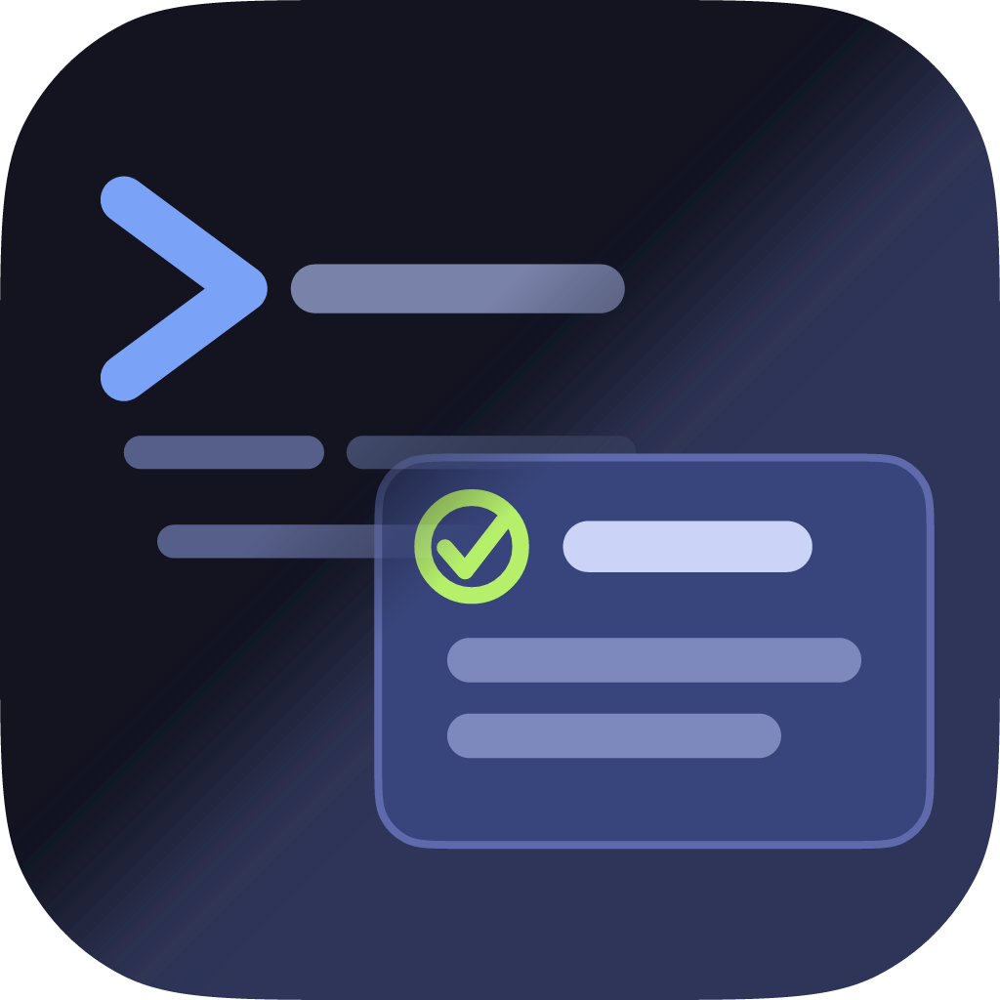

  

# un-bien

Mobile remote control and local agent mesh for the [Pi coding agent](https://github.com/earendil-works/pi):
a native iOS/macOS client that pairs to your machine over a relay, watches tool
calls in real time, and drives Pi from your phone — plus a local agent mesh so
multiple Pi sessions (and agents) can talk to each other.

> **Status:** early / in flux. The READMEs and docs (including the per-package
> `extension/README.md` and `relay/README.md`, still carrying upstream branding)
> are being reworked — this top-level README is a placeholder while that lands.

## Monorepo layout

| Path         | What it is                                                              |
| ------------ | ----------------------------------------------------------------------- |
| `app/`       | Native SwiftUI client (iOS + macOS). Build/test with `swift build` / `swift test`. |
| `extension/` | The Pi extension (TypeScript). Loaded by pointing `pi` at the repo root (`pi.extensions` → `./extension/dist`). Build with `pnpm -C extension build`. |
| `relay/`     | The WebSocket relay (Rust, package `un-bien-relay`). A dumb, end-to-end-encrypted pipe. |
| `docs/`      | Protocol notes and fixtures.                                            |

## Attribution

un-bien is derived from **[remote-pi](https://github.com/jacobaraujo7/remote_pi)**
by **Jacob Moura** ([@jacobaraujo7](https://github.com/jacobaraujo7)), used under
the MIT License. The `extension/` and `relay/` trees began as forks of that
project — thank you to Jacob and the remote-pi contributors for the original
design and implementation, which un-bien builds on.

The original MIT license and copyright are preserved in
[`extension/LICENSE`](extension/LICENSE). un-bien's own changes (the native app,
the rpc-envelope protocol, the monorepo consolidation, and the un-bien rename)
are © 2026 George Harker, likewise under the MIT License.
