A tour of the iOS/macOS client: first run, adding a relay, pairing a machine,
and what each part of the transcript does.

This guide assumes you already have **a relay running** and **Pi with the
un-bien extension** on a machine — if not, start with
[Install & setup](install.md) and come back. If you just want to look around
first, the app ships a [demo mode](#demo-mode--look-around-first) that needs
neither.

---

## First run — your Owner key

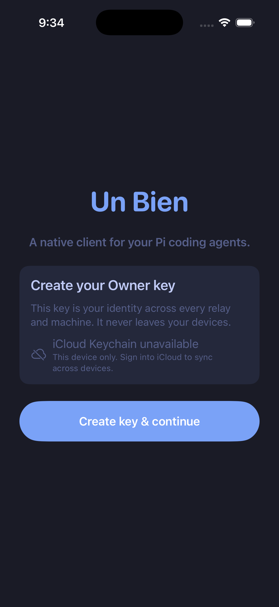{width=40% fig-align="center"}

The app opens on a single decision. The **Owner key** is your identity across
every relay and machine you ever pair — not an account, not a login, and not
something a server issues to you. It is generated on the device and never
leaves it.

Tap **Create key & continue**.

The line above the button reports whether iCloud Keychain is available. If it
says **unavailable**, the key is created for _this device only_ — everything
works, but a second device (your iPad, your Mac) will be a stranger to your
machines and needs its own pairing. Sign into iCloud before creating the key
if you want one identity across your devices.

> Losing the key means losing the identity. There is no recovery flow and no
> operator who can reissue it — that is the point of it never leaving your
> devices. iCloud Keychain is the backup story.

---

## Demo mode — look around first

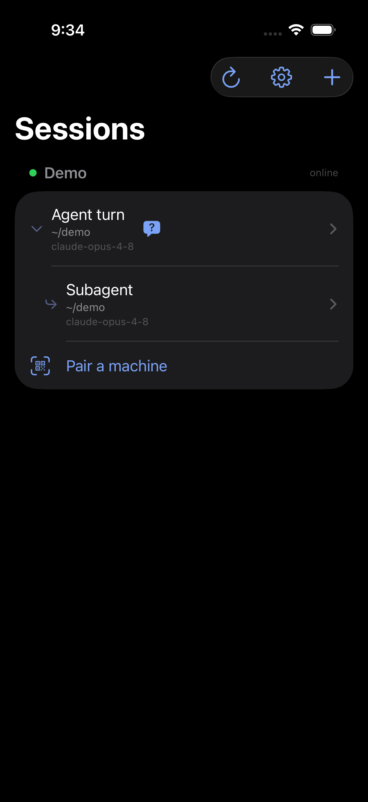{width=40% fig-align="center"}

Before any relay exists, the list shows a **Demo** group with canned sessions.
It is a real transcript rendered by the real UI — tool cards, diffs, syntax
highlighting — with no network behind it.

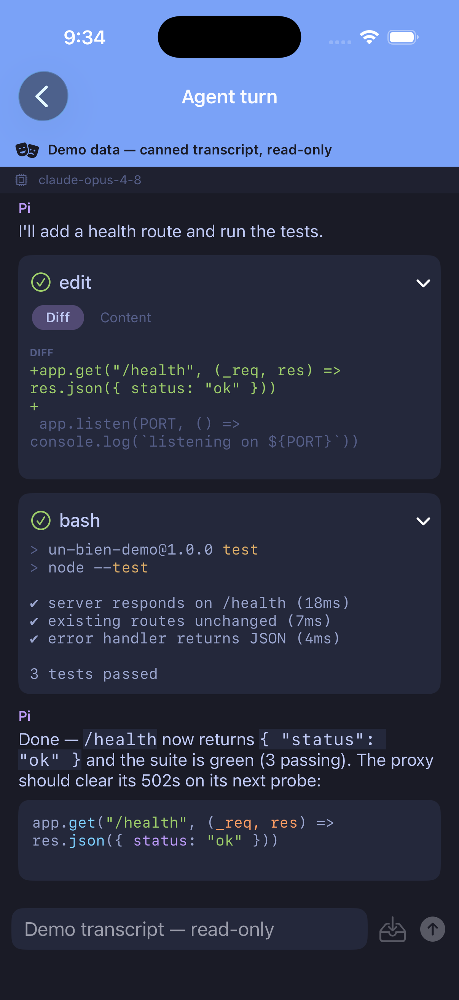{width=40% fig-align="center"}

The banner says **Demo data — canned transcript, read-only**, and the composer
is disabled to match. It is worth opening once: the tool cards here are the
same ones you will read later, including the **Diff / Content** switcher on an
`edit` card, which toggles between the patch and the file content it produced.

---

## Add a relay — the `+` button

Nothing connects until you add a relay, and **the app ships pointing at
nobody** — there is no default server. This is the step people miss.

On the Sessions screen, the toolbar has three buttons:

| Button | Action                                  |
| ------ | --------------------------------------- |
| ↻      | Refresh — re-query the relays for rooms |
| ⚙︎      | App settings (themes, fonts, advanced)  |
| **+**  | **Add a relay**                         |

Tap **+** and give the relay a name and a URL.

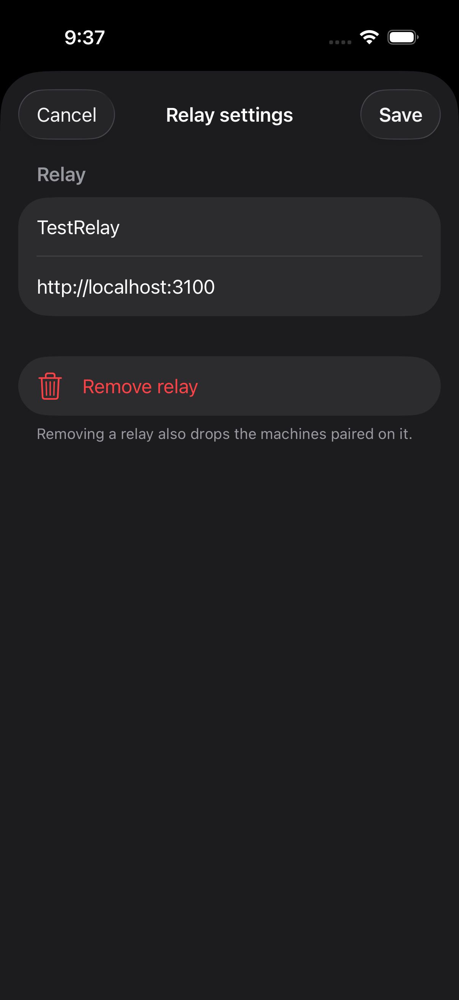{width=40% fig-align="center"}

The **name** is yours — a label for the list, nothing more. The **URL** is the
address your _phone_ can reach, which is not always the address your machine
uses: `http://localhost:3100` only works if the relay runs on the same device,
so on a phone this is usually a LAN address (`http://192.168.1.20:3000`) or a
Tailscale name (`http://relay-box:3000`). Use the same URL you gave the
extension via `/unbien set-relay`.

Reopening this sheet later (**Relay settings** on the relay's card) is also how
you remove one. Removing a relay **also drops the machines paired on it** — the
pairings live per-relay, so you would need to pair again.

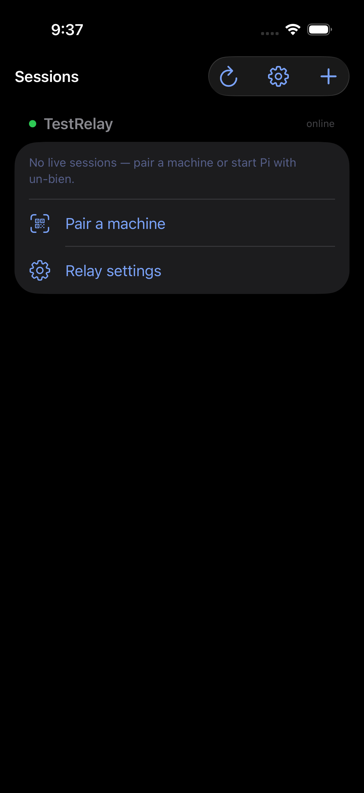{width=40% fig-align="center"}

With the relay saved you get a green **online** dot and an empty group: _"No
live sessions — pair a machine or start Pi with un-bien."_ Online means the app
reached the relay. It says nothing about whether any machine is there yet.

---

## Pair a machine

Pairing is what tells your machine that this device is yours. It is **per
machine, not per session**: pair once and every Pi process on that machine
accepts the device, including the launcher daemon.

On the machine, in Pi:

```text
/unbien pair
```

Then tap **Pair a machine** in the app.

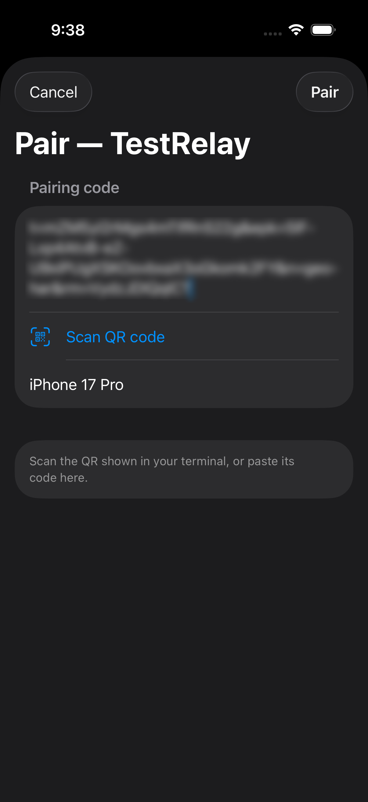{width=40% fig-align="center"}

Two ways across, and they are equivalent:

- **Scan QR code** — point the camera at the QR in your terminal.
- **Paste the code** — the `t=…&epk=…&n=…&rm=…` string printed beneath the QR,
  for when the terminal is on the same device or the camera is not an option.

The last field is **this device's name** as your machine will list it (here
`iPhone 17 Pro`) — it is what you will see in `/unbien devices`, and what you
would name in `/unbien revoke`. Tap **Pair**.

> The pairing code is single-use and short-lived. If it expires, re-run
> `/unbien pair`.

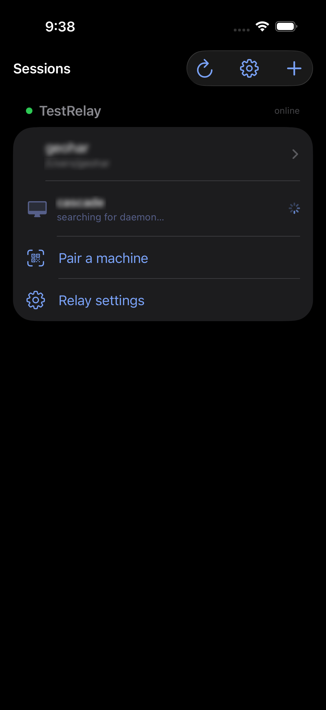{width=40% fig-align="center"}

After pairing the group fills in, and it holds **two different kinds of row**:

- **Sessions** — `geohar` with its working directory `/Users/geohar`. Tap to
  attach.
- **Machines** — `cascade`, with a monitor icon and _"searching for daemon…"_.
  This is a paired machine with no live Pi session. If the
  [launcher](../launcher/README.md) is installed and remote launch is enabled
  for a directory, you can start a session on it from here; the spinner is the
  app looking for that daemon.

---

## Reading a transcript

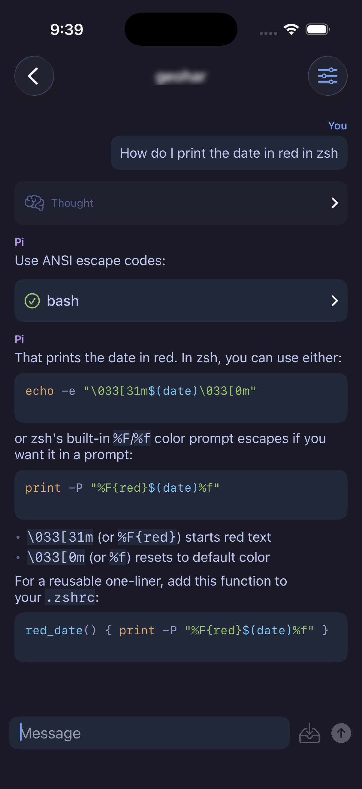{width=40% fig-align="center"}

Top to bottom, the pieces:

- **You** — your messages, right-aligned.
- **Thought** — the model's reasoning, collapsed behind a brain icon. Tap to
  expand. (Hidden entirely if you turn thinking off in settings.)
- **Pi** — assistant prose, rendered as markdown with syntax-highlighted code.
- **Tool cards** — one per tool call, labelled by tool (`bash`, `edit`) with a
  green check when it succeeded. Tap to expand the input and output. An `edit`
  card gets the **Diff / Content** switcher seen in the demo.

The composer has two send buttons, and the difference matters:

| Control   | Meaning                                             |
| --------- | --------------------------------------------------- |
| ↑ (arrow) | **Send now** — deliver the message to the agent     |
| ⬇︎ (tray)  | **Queue** — hold it until the current turn finishes |

Queueing is the one to reach for while the agent is mid-turn: it lands your
next instruction without interrupting the work in flight.

The **⚙︎ sliders** button in the nav bar opens the session's control menu —
model, thinking level, token usage, and whether the context has been compacted.

---

## When the agent asks you something

Agents can stop and ask. When one does, the question arrives on your phone as a
sheet you answer directly — you are not reduced to watching a terminal wait.

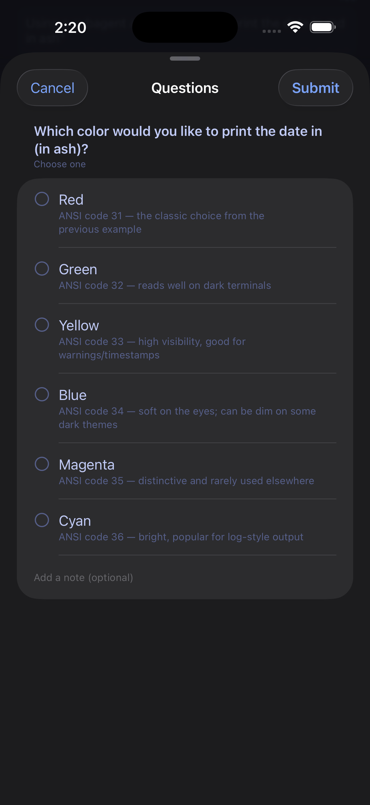{width=40% fig-align="center"}

Pick an option, optionally **Add a note**, and **Submit**. The answer goes back
to the agent and the turn continues.

Two things worth knowing:

- A waiting question **badges the session on Home** — the blue `?` bubble on the
  row. The sheet only presents inside the open transcript, so without that badge
  an ask that fired while you were elsewhere would be invisible.
- Either end can answer. If you reply on the machine instead, the sheet on the
  phone dismisses itself.

---

## Subagents

When the agent delegates, the subagent shows up in three places at once.

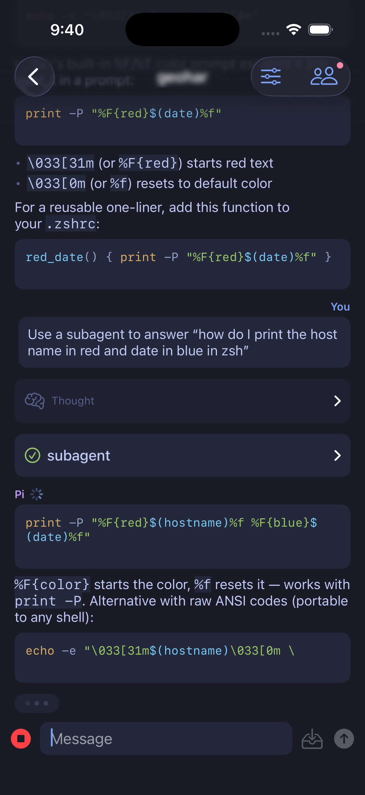{width=40% fig-align="center"}

**In the transcript**, as a `subagent` tool card with a status glyph. While the
turn runs, the composer's send button becomes a red **stop** — that is your
interrupt.

Notice the **people icon** in the nav bar, with a dot on it. That is a
**panel** — a side surface the machine publishes, not a fixed part of the app.
The dot means it has changed since you last looked.

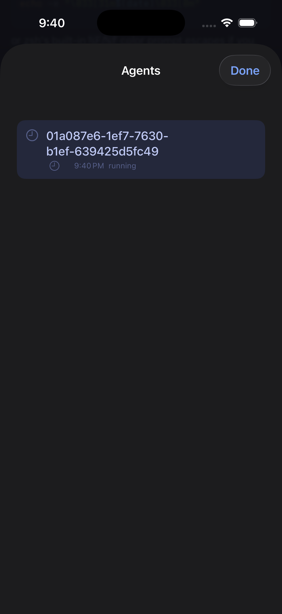{width=40% fig-align="center"}

**In the Agents panel**, each subagent is listed with its id, start time and
live status (`running` here).

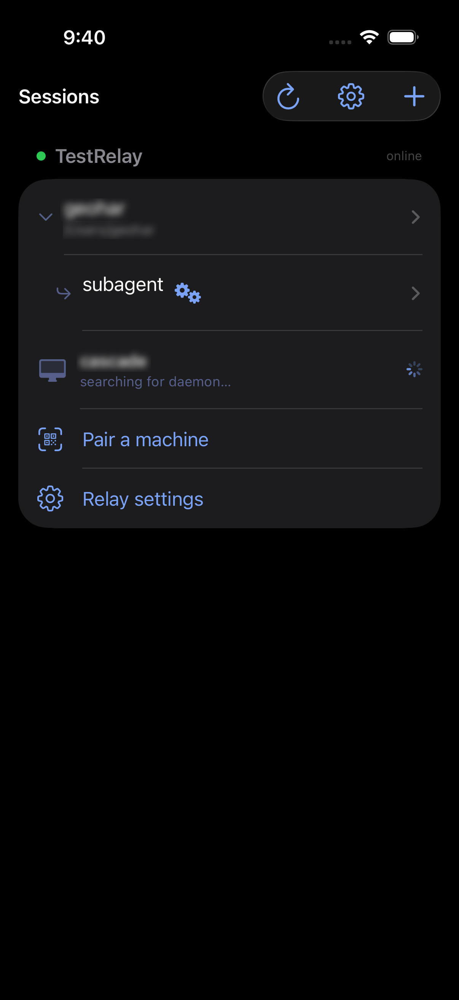{width=40% fig-align="center"}

**And on the Sessions list**, nested under its parent with a `↳` and a status
glyph — spinning gears for running, a check when done, a cross if it failed.
Tap it to open the subagent's own transcript and read its work directly, as a
session in its own right.

---

## Managing sessions

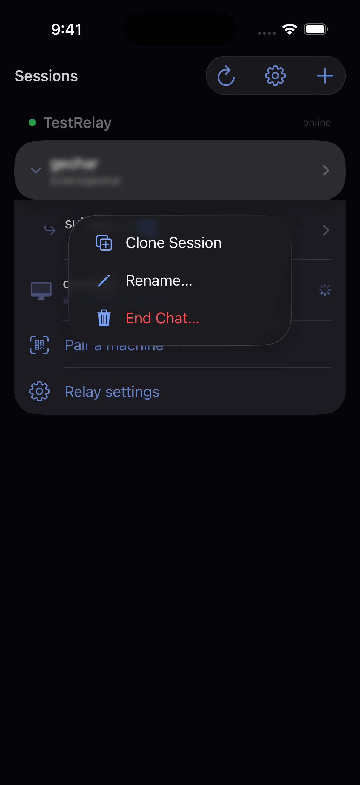{width=40% fig-align="center"}

Long-press any session row:

- **Clone Session** — a new session starting from this one's history.
- **Rename…** — a label for your list.
- **End Chat…** — terminates the session on the machine. Destructive, hence
  the red.

Sessions you have merely stopped following offer **Remove from List** instead,
which drops it locally without touching the machine.

---

## Forking and branching

You can restart the conversation from any earlier point. Long-press a message:

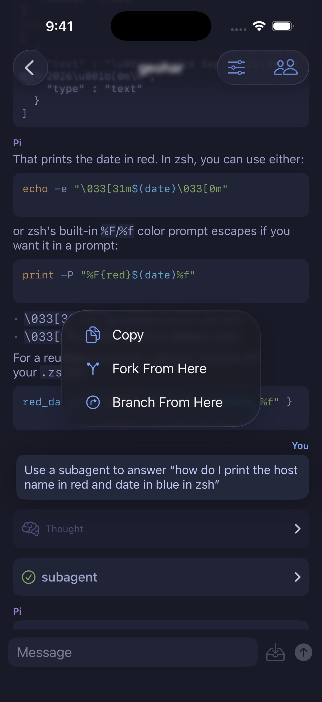{width=40% fig-align="center"}

- **Copy** — the message text.
- **Fork From Here** — a _new session_ that inherits history up to this point.
- **Branch From Here** — a new path _inside this session_, leaving the original
  intact.

The distinction is where the result lives: a **fork** gives you a separate
session in the list; a **branch** stays in this session and becomes navigable
history.

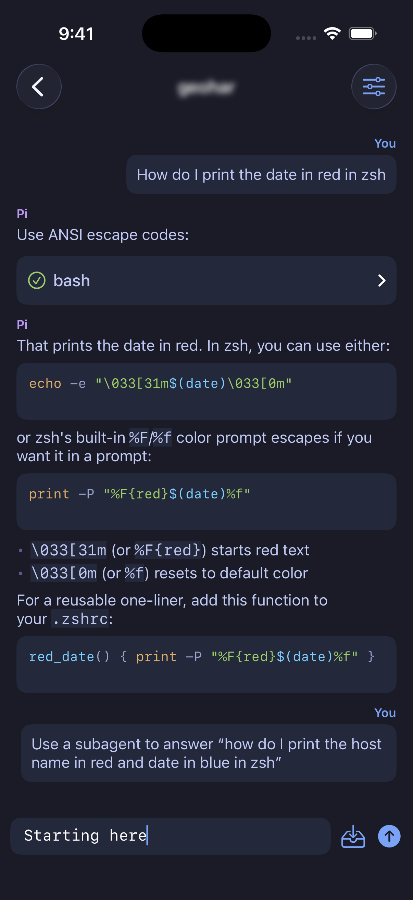{width=40% fig-align="center"}

Either way you land with the history above you and the composer ready for the
message that takes a different direction.

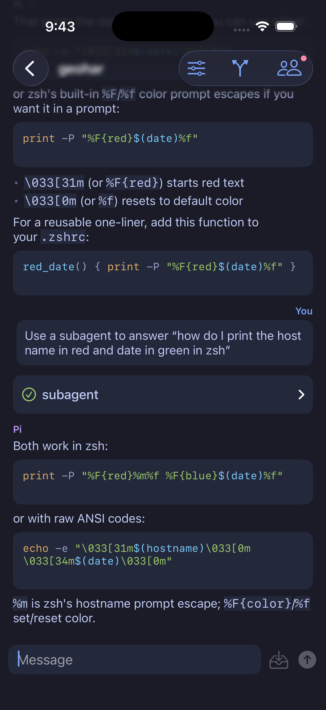{width=40% fig-align="center"}

Once a session has branches, a **branch icon** appears in the nav bar. It is
not there before — its presence is itself the signal that this session has more
than one path through it.

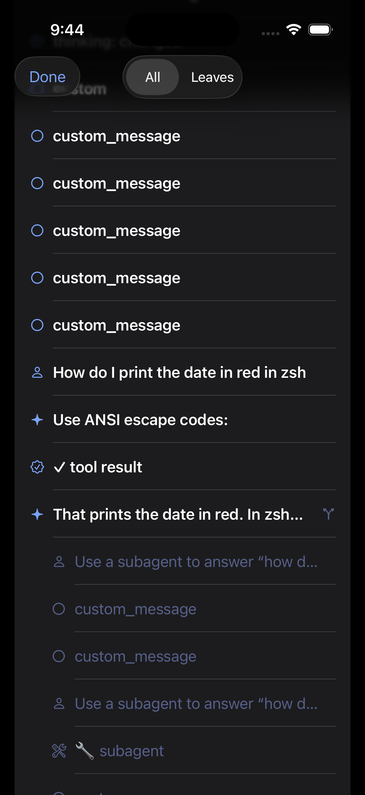{width=40% fig-align="center"}

Tapping it opens the **session tree**: every entry in the conversation, with
the branch points marked and alternate paths dimmed. The **All / Leaves**
switch is the useful control — _Leaves_ collapses the tree to just the tips,
which is how you jump between outcomes rather than re-reading the shared
history. Tap any entry to navigate there.

---

## Panels — Plan and Agents

Panels are surfaces the **machine** publishes; they appear as nav-bar buttons
only when a session actually has them, each with a dot when it has unseen
changes. Agents (above) is one. Plan is the other.

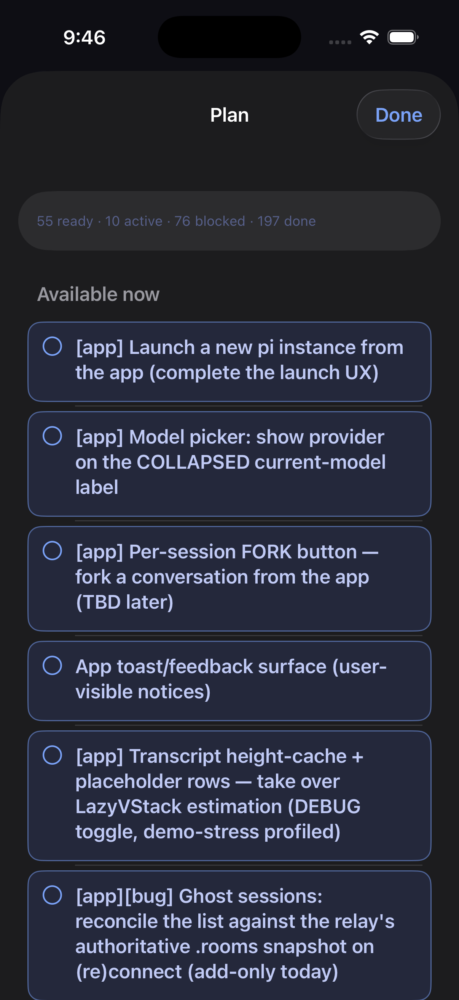{width=40% fig-align="center"}

The Plan panel summarises the work queue — _ready · active · blocked · done_ —
and lists what is actionable now. It is driven by the plan tooling on the
machine, so it reflects whatever the agent is actually tracking rather than
anything the app invents.

Both pi-subagents extensions should work - [`@gotgenes/pi-subagents`](https://github.com/gotgenes/pi-packages) and [`@tintinweb/pi-subagents`](https://github.com/tintinweb/pi-subagents)
For plans, the protocol is pi-event driven. (Cribsheet)[https://docs.georgeharker.com/cribsheet/main/] memory system along with (pi-plan)[https://github.com/georgeharker/pi-plan] supports this protocol and sends events on the event bus which un-bien picks up.

---

## Where to go next

- [Install & setup](install.md) — relays, the extension, deployment flows
- [Remote launch](../extension/README.md#remote-launch) — starting sessions on
  a machine from the app
- [Privacy policy](privacy.md) — what the relay operator can and cannot see
