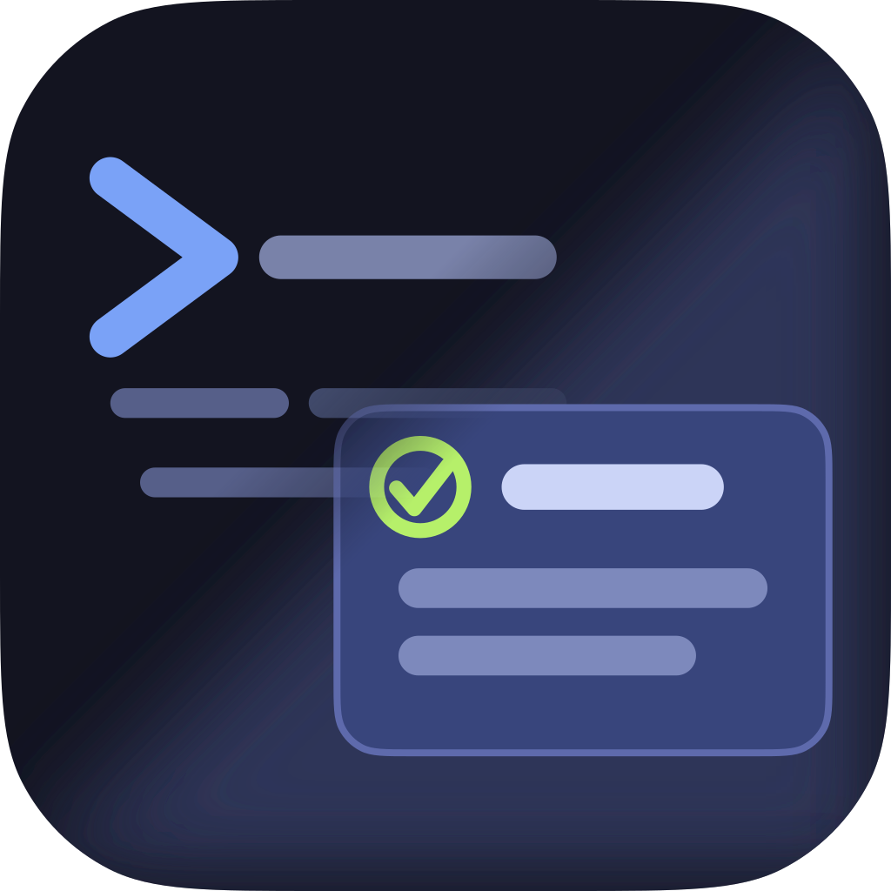

  

## What is Un Bien?

**Un Bien is remote control for your [Pi coding agent](https://github.com/earendil-works/pi)
sessions** — a native macOS and iOS app that **attaches to a running Pi session,
or launches a new one**, and lets you drive it from your phone.

Pair your device once by QR, over a relay you host yourself, and Pi's session
comes with you: streaming responses, **styled summaries of edits and tool
results**, interactive prompts you can answer, and live model/thinking
controls — all rendered natively.

The same plumbing carries a second capability: a **local agent mesh**, where
multiple Pi sessions on your machines can discover and message each other.

### At a glance

- **Native macOS / iOS app** — attach to running Pi sessions or launch new ones.
- **Self-hosted relay** — a small WebSocket server you run to connect the app to
  your machine. No default relay, no third party in the path.
- **Styled transcripts** — Markdown + syntax highlighting, with readable
  summaries for edits and tool results rather than raw diffs and JSON.
- **Interactive prompts** — answer Pi's confirm / select / input prompts from
  the app.
- **Model & thinking control** — switch models and thinking levels on the fly.
- **Image display** — renders images your tools and the agent produce.
- **Local agent mesh** — several Pi sessions coordinating over a local broker,
  optionally bridged across machines through the relay.
- **Remote launch** — a small launcher daemon lets the app start Pi sessions on
  your machine (via tmux/herdr) even when no Pi is running.

> **Status:** WIP and actively maturing — functional and usable today, with
> polish landing toward the first public release.

---

## Where to next

| I want to…                                       | Document                               |
| ------------------------------------------------ | -------------------------------------- |
| Get the big picture                              | [Overview (README)](README.md)         |
| Install & set everything up                      | [Install & setup](docs/install.md)     |
| Use the extension & commands                     | [Extension guide](extension/README.md) |
| Go deeper (design, protocol, building & signing) | [Design & development](docs/design.md) |

---

Un Bien is derived from [remote-pi](https://github.com/jacobaraujo7/remote_pi)
by Jacob Moura (MIT); see the [README](README.md#attribution) for attribution.
